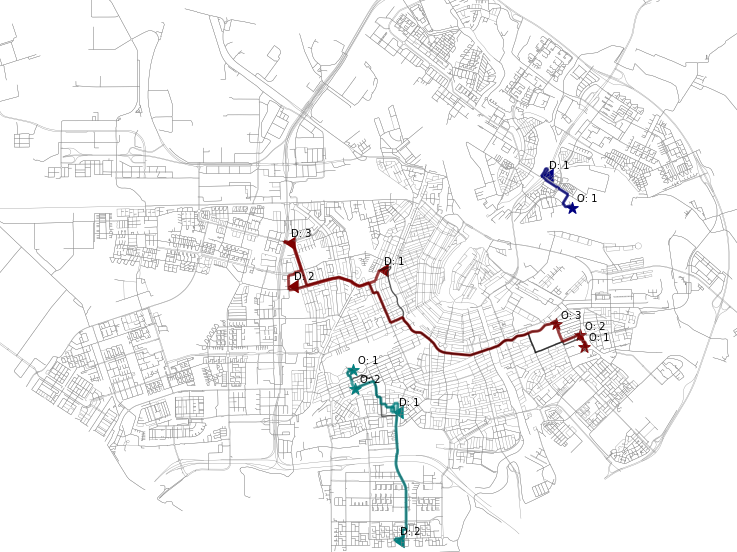

# ExMAS
> Exact Matching of Attractive Shared rides (ExMAS) for system-wide strategic evaluations
---

ExMAS allows you to match trips into attractive shared rides.

For a given:
* network (`osmnx` graph), 
* demand (microscopic set of trips _q_i = (o_i, d_i, t_i)_)
* parameters (behavioural, like _willingness-to-share_ and system like _discount_ for shared rides)

It computes:
* optimal set of shared rides (results of bipartite matching with a given objective)
* shareability graph
* set of all feasible rides
* KPIs of sharing
* trip sharing attributes 

ExMAS is a `python` based open-source package applicable to general networks and demand patterns.

If you find this code useful in your research, please consider citing:

>_Kucharski R. , Cats. O 2020. Exact matching of attractive shared rides (ExMAS) for system-wide strategic evaluations, Transportation Research Part B 139 (2020) 285-310_ [https://doi.org/10.1016/j.trb.2020.06.006](https://doi.org/10.1016/j.trb.2020.06.006)

### Documentation

* [Quickstart tutorial](https://github.com/RafalKucharskiPK/ExMAS/blob/master/ExMAS/notebooks/ExMAS.ipynb)
* [Configuration](https://github.com/RafalKucharskiPK/ExMAS/blob/master/notebooks/01_Configuration.ipynb)
* [Your own networks](https://github.com/RafalKucharskiPK/ExMAS/blob/master/notebooks/02_Network_graphs.ipynb)
* [You own demand](https://github.com/RafalKucharskiPK/ExMAS/blob/master/notebooks/03_Demand_generation.ipynb)
* [Bigger demand levels](https://github.com/RafalKucharskiPK/ExMAS/blob/master/notebooks/04_Real_demand_size.ipynb)
* [Parallel experiments and plotting results](https://github.com/RafalKucharskiPK/ExMAS/blob/master/notebooks/05_Parallel_experiments.ipynb)
* [Completeness test](https://github.com/RafalKucharskiPK/ExMAS/blob/master/notebooks/06_Completeness_test.ipynb)

### Installation

`pip install ExMAS`

or clone this repository

----
Rafał Kucharski, TU Delft, 2020 r.m.kucharski (at) tudelft.nl

